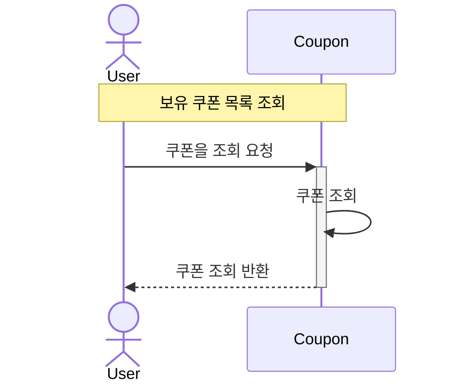
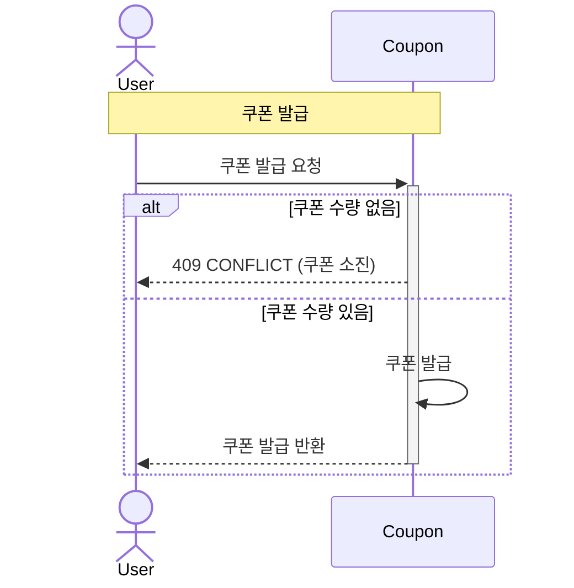
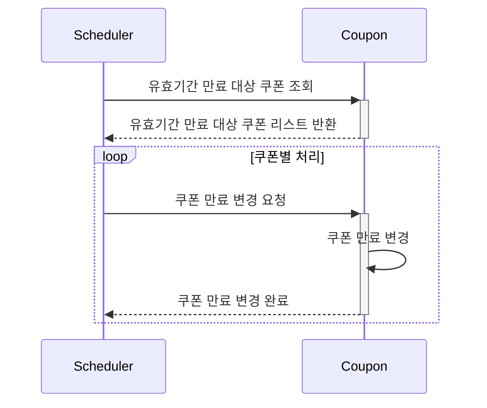

 # 🎟️ 쿠폰 목록 조회 시퀀스 다이어그램

✅ 위 다이어그램은 쿠폰 목록 조회을 보여줍니다.
- `GET /api/v1/coupons`: 보유 쿠폰 목록 조회
---

# 🎟️ 선착순 쿠폰 발급 시퀀스 다이어그램

✅ 위 다이어그램은 선착순 쿠폰 발급을 보여줍니다.
- `POST /api/v1/coupons/{couponId}/claim`: 선착순 쿠폰 발급 요청

---
# 쿠폰 만료 처리 스케줄러 시퀀스 다이어그램

✅ 위 다이어그램은 사용되지 않고 기한이 만료된 쿠폰을 스케줄러가
쿠폰 상태를 만료로 변경하는 흐름을 설명합니다.

---