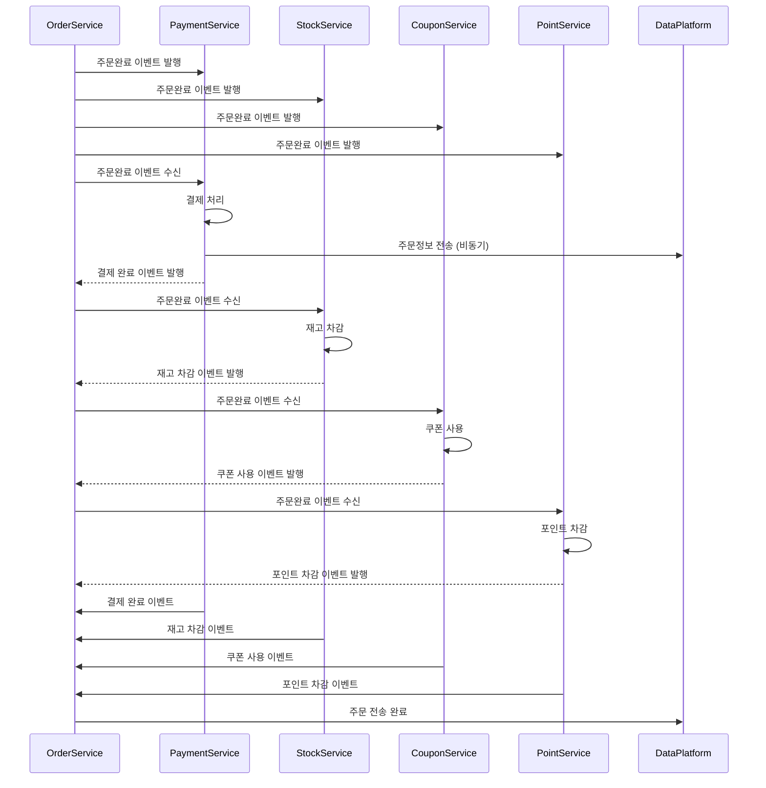
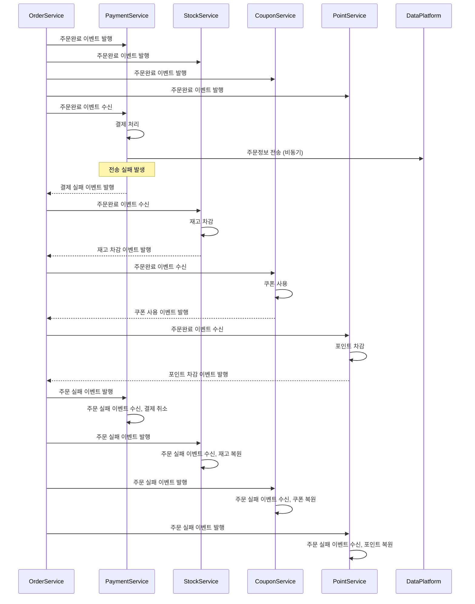

# 서비스 도메인 분리 설계(MSA 기반)

> 주문, 결제, 재고, 쿠폰, 포인트 등 복합 도메인으로 구성된 서비스 환경에서
> MSA(Microservice Architecture)로 분리 시 발생할 수 있는 트랜잭션 일관성 문제를 해결하기 위해
> Saga 패턴(코레오그래피 기반)과 보상 트랜잭션을 활용한 아키텍처 설계 및 흐름을 기술한 문서입니다.
> 특히, 도메인별 독립 배포와 이벤트 기반 비동기 처리에 적합하도록 설계하였습니다.

## 도메인별 배포 단위 설계

| 도메인             | 역할 요약                        |
|--------------------|------------------------------|
| 주문 서비스 (Order)  | 주문 생성, 상태 전이, 실패/완료 판단의 주체   |
| 결제 서비스 (Payment) | 결제 승인/취소 처리, 외부 PG 연동        |
| 재고 서비스 (Stock)   | 상품 재고 확인 및 차감, 재고 복원         |
| 쿠폰 서비스 (Coupon)  | 쿠폰 유효성 확인, 쿠폰 사용/복원          |
| 포인트 서비스 (Point) | 포인트 차감 및 환불                  |
| 데이터 플랫폼         | 주문 성공 시 외부 데이터 연동 (전송, 로그 등) |

---

## 트랜잭션 처리의 한계

- 각 도메인이 물리적으로 분리되어 별도의 배포 단위로 운영되면서, **서로 다른 트랜잭션 컨텍스트와
데이터 베이스를 사용**하게 됨. 이로 인해, 단일 트랜잭션처럼 전체 작업을 한번에 커밋/롤백하는 것이 기술적으로 불가능 해집니다.
- 따라서 MSA 환경에서는 **Saga 패턴, 보상 트랜잭션, 이벤트 기반 처리** 등을 통해 **데이터 정합성을 점진적으로 맞추는 방식(Eventual Consistency)** 이 요구됩니다.

---

## 해결 방안 설계

- 본 아키텍처는 **코레오그래피 기반을 선택한 이유**는 다음과 같습니다:
  - 중앙 조정자가 없는 구조로 인해 각 도메인의 **결합도를 낮출 수 있으며**, 각 도메인은 이벤트 기반으로 독립적으로 동작할 수 있음
  - **확장성**이 뛰어나고, 새로운 도메인을 추가하더라도 기존 로직의 변경 없이 이벤트를 구독하여 처리 가능
  - **단일 실패 지점(SPOF)**이 존재하지 않기 때문에, 시스템 복원력(resilience)이 높아짐
  - 복잡한 오케스트레이션 로직을 별도로 구현하지 않아도 되고, **도메인 중심의 설계**에 더 적합

### Saga 패턴(코레오그래피 기반)

### 성공

### 실패 

##  보상 트랜잭션 설계

| 도메인   | 실패 시 보상 방식         |
|----------|----------------------------|
| 재고     | 재고 수량 복원              |
| 쿠폰     | 쿠폰 상태 복원              |
| 포인트   | 포인트 환불                 |
| 결제     | 결제 취소 요청 (PG 연동)     |

- 각 도메인은 **자기 실패를 인지하면 즉시 보상 처리**

---

## 추가 고려사항

| 항목               | 처리 방안                                                                 |
|--------------------|---------------------------------------------------------------------------|
| 이벤트 중복 처리       | orderId + domain 기준 중복 이력 테이블, PK 또는 유니크 제약 사용                    |
| 보상 실패 처리        | 보상 실패 로그 저장, 재시도 큐 적재, 운영자 알림                                      |
| 외부 API 보상 불가 문제 | 후처리 전송 방식으로 분리, 실패 시 DLQ 또는 관리자 대시보드로 이관                      |
| 전체 흐름 추적         | 이벤트 로그 저장, event_log 테이블 + traceId, orderId 기반 조회 설계 필요         |

## 결론

- 도메인별 독립 배포(MSA)를 위해, **코레오그래피 기반 Saga 패턴 + 보상 트랜잭션** 구조를 채택
- 중앙 조정자 없이, 각 도메인이 자율적으로 성공/실패/보상을 판단
- 메시지 브로커(Kafka 등)를 도입하면 서비스 간 이벤트 전달의 비동기 처리, 내결함성, 메시지 유실 방지 및 재처리(Offset 기반)가 가능하여, 코레오그래피 기반 아키텍처에 강력한 기반이 됨
- Kafka의 topic 분리를 통해 도메인 단위의 이벤트 흐름을 명확하게 관리할 수 있고, DLQ(Dead Letter Queue)를 통해 보상 실패나 장애 상황에 대한 모니터링 및 후속 처리 체계 마련 가능
