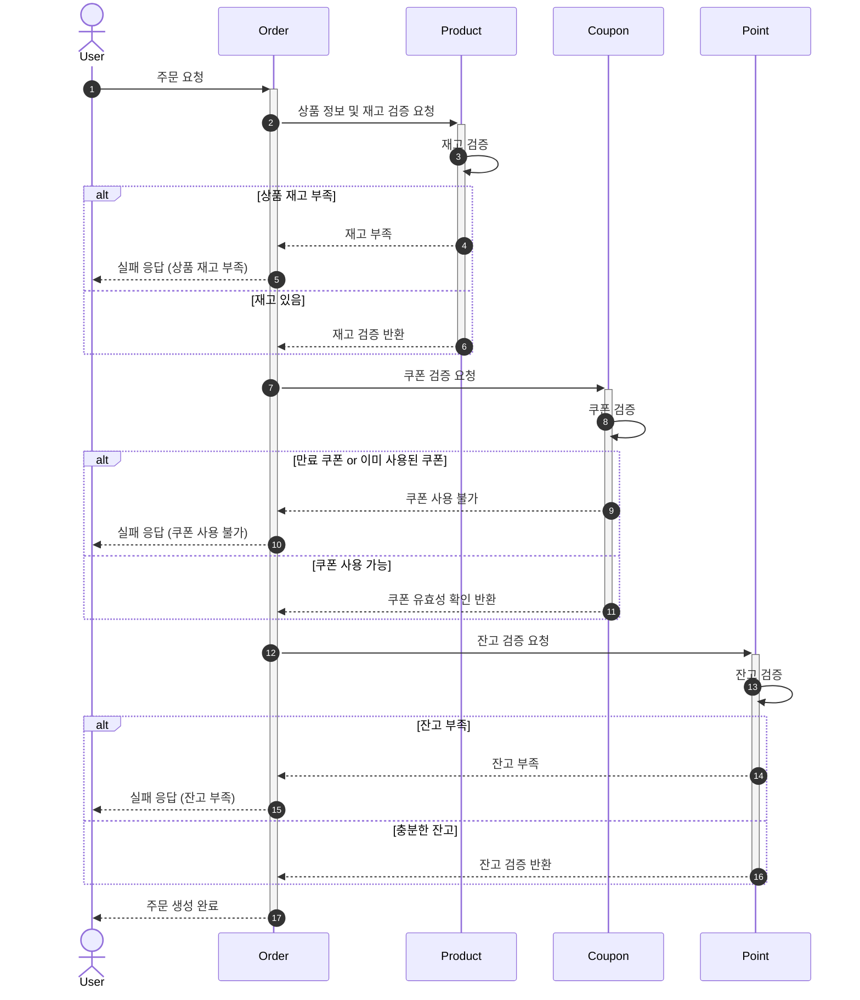
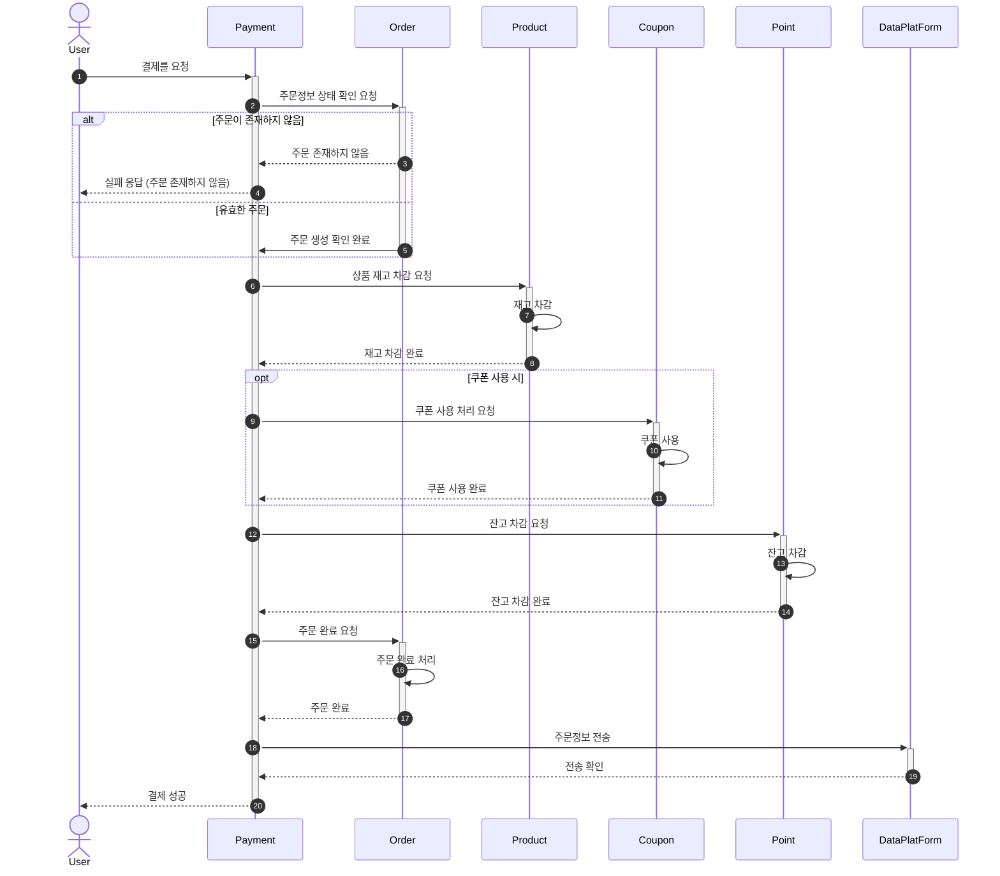
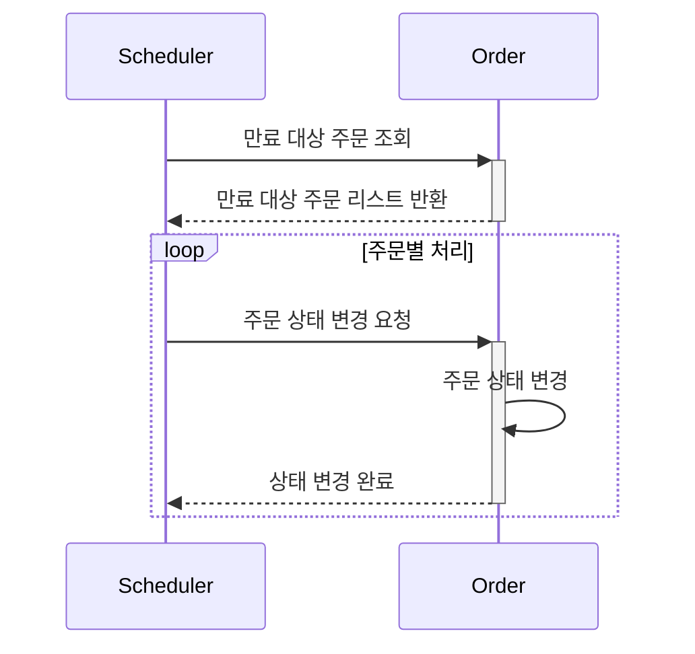

# 🛒 주문 시퀀스 다이어그램

주문 기능 전체 흐름을 설명합니다.
- `POST /api/v1/orders`: 주문 요청 (상품 목록, 쿠폰, 잔액)
- 주문 전 재고,쿠폰(선택),잔액 확인 -> 주문 생성 완료

---
# 🛒 결제 시퀀스 다이어그램

결제 기능 전체 흐름을 설명합니다.
- `POST /api/v1/payments`: 결제 요청 (주문 정보)
- 결제 전 주문 생성 확인 → 잔액 차감 -> 쿠폰 사용 → 재고 차감 → 주문 데이터 전송

---
# 주문 만료 처리 스케줄러 시퀀스 다이어그램 

결제되지 않고 일정 시간(15분)이 경과한 주문을 스케줄러가
주문 상태를 만료로 변경하는 흐름을 설명합니다.

---