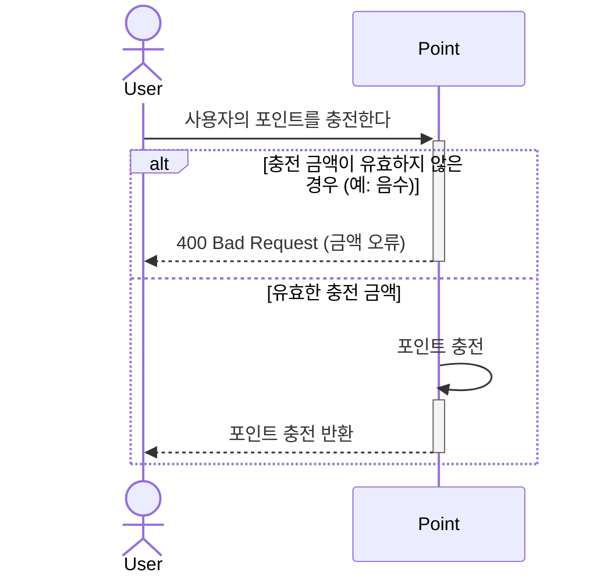
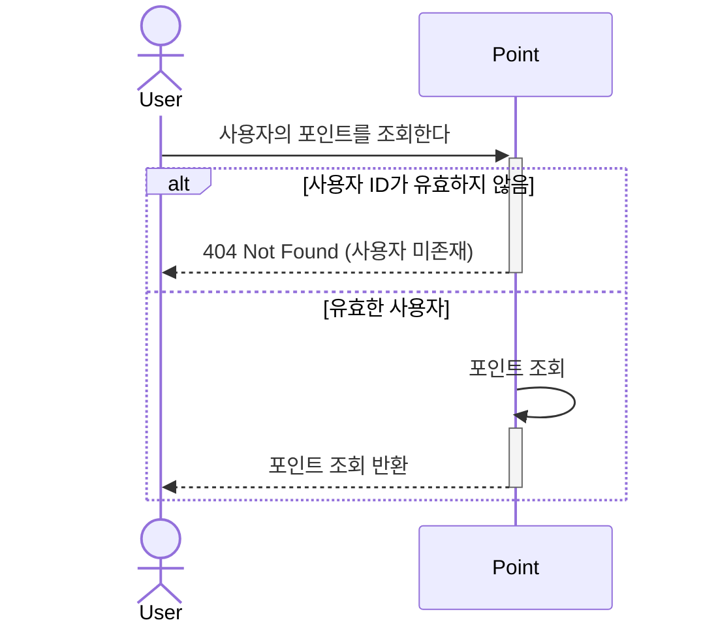

# 💰 잔액 충전 시퀀스 다이어그램

```mermaid
sequenceDiagram
    actor User
    participant Point

    User->>+Point: 사용자의 포인트를 충전한다
    alt 충전 금액이 유효하지 않은 경우 (예: 음수)
        Point-->>-User: 400 Bad Request (금액 오류)
    else 유효한 충전 금액
        Point->>+Point: 포인트 충전
        Point-->>-User: 포인트 충전 반환
    end
```

**포인트 충전** 흐름을 설명합니다.
- `POST /api/v1/point/charge` : 포인트 충전 요청

***

# 💰 잔액 조회 시퀀스 다이어그램

```mermaid
sequenceDiagram
    actor User
    participant Point

    User->>+Point: 사용자의 포인트를 조회한다
    alt 사용자 ID가 유효하지 않음
        Point-->>-User: 404 Not Found (사용자 미존재)
    else 유효한 사용자
        Point->>+Point: 포인트 조회
        Point-->>-User: 포인트 조회 반환
    end
```

**잔액 조회** 흐름을 설명합니다.
- `GET /api/v1/point/balance` : 포인트 조회 요청