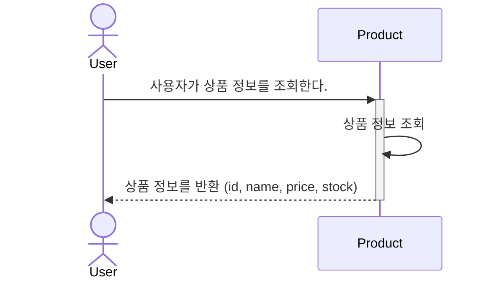
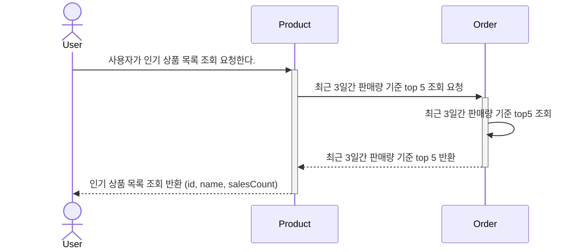

# 📦 상품 조회 시퀀스 다이어그램

사용자가 상품 목록을 조회하는 흐름을 설명합니다.
- `GET /api/v1/product` : 전체 상품 목록 조회 요청

--- 
# 📈 상위 인기 상품 조회 시퀀스 다이어그램

최근 3일간 가장 많이 팔린 상위 5개 상품을 조회하는 흐름을 설명합니다.
- `GET /api/v1/products/rank`: 인기 상품 목록 요청
- Order 통해 판매 통계 기반 인기 상품 집계