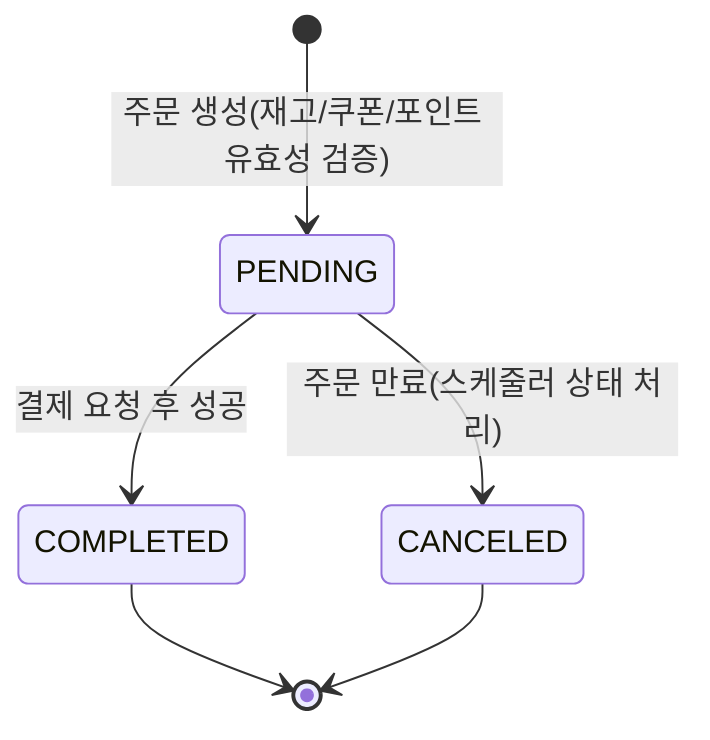
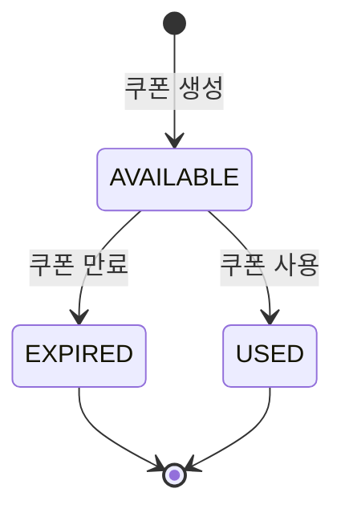

# 주문(Order) 상태 다이어그램
PENDING,COMPLETED,CANCELED 은  Order의 상태로 생각해봤습니다.

주문생성 -> 주문 성공, 주문 생성 -> 주문 만료

```mermaid
    stateDiagram-v2
    [*] --> PENDING : 주문 생성(재고/쿠폰/포인트 유효성 검증)
    PENDING --> COMPLETED : 결제 요청 후 성공
    PENDING --> CANCELED :주문 만료(스케줄러 상태 처리)

    COMPLETED --> [*]
    CANCELED --> [*]
```

# 쿠폰(Coupon) 상태 다이어그램

```mermaid
    stateDiagram-v2
    [*] --> AVAILABLE : 쿠폰 생성
    
    AVAILABLE --> USED : 쿠폰 사용
    AVAILABLE --> EXPIRED : 쿠폰 만료
    
    EXPIRED --> [*]
    USED --> [*]
```