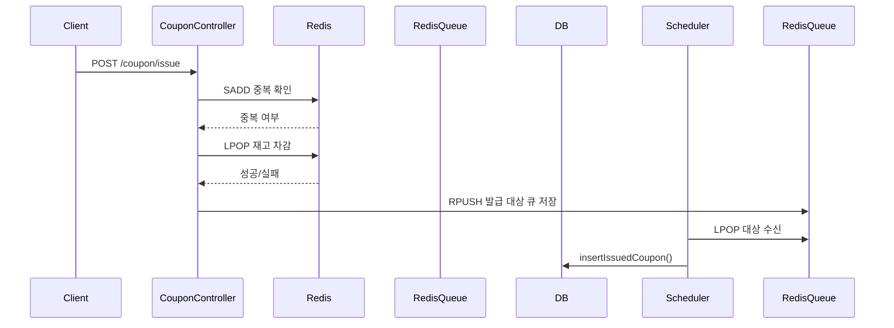
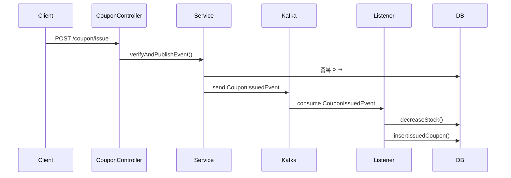

# Redis 기반 vs Kafka 기반 쿠폰 발급 시스템 비교 설계

---

## 1. 전환 배경

기존에는 Redis를 활용하여 선착순 쿠폰 발급을 처리했으나, 확장성과 장애 대응 측면에서 Kafka 기반 아키텍처로 전환하게 되었다.

---

## 2. 기존 구조 (Redis 기반)

### 구성

- **중복 체크**: Redis Set (`SADD coupon-issue-users:{couponId} {userId}`)
- **재고 차감**: Redis List (`LPOP coupon-stock:{couponId}`)
- **DB 저장**: Redis List로 큐잉된 유저들을 스케줄러가 주기적으로 저장

### 시퀀스 다이어그램

---

## 3. 개선 구조 (Kafka 기반)

### 구성

- **중복 체크**: DB에서 `user_coupon` 존재 여부 확인
- **이벤트 발행**: Kafka로 `CouponIssuedEvent` 발행
- **Kafka Listener**: 수량 차감 및 발급 이력 저장 (DB 트랜잭션 사용)

### 시퀀스 다이어그램

---

## 4. 비교

| 항목              | Redis 기반 구조                      | Kafka 기반 구조                          |
|------------------|--------------------------------------|------------------------------------------|
| 중복 체크         | Redis Set                            | DB 조회                                   |
| 재고 차감         | Redis List (LPOP)                   | DB Update (decreaseStock)               |
| 발급 처리         | Redis 큐 + Scheduler                 | Kafka Consumer → DB 저장                 |
| 트랜잭션 범위     | 없음                                 | Listener 내 @Transactional 사용         |
| 재처리            | 어렵고 수동                          | Kafka 리플레이로 가능                    |
| 외부 연동 용이성   | 낮음                                 | 높음 (Kafka 이벤트 발행)                 |

---

## 5. 개선 효과

- **장애 분리**: 발급 요청과 실제 DB 반영을 분리
- **운영 편의성**: Kafka Topic 기반으로 재처리 및 모니터링 용이
- **확장성**: 다양한 이벤트 소비자 구성 가능

---

## 6. 향후 개선 사항

- Exactly-once 처리: Kafka Idempotent + DB unique key
- DLQ 처리: 실패 이벤트를 별도 Topic으로 분리
- 이벤트 리플레이 지원
- 모니터링 시스템 연동 (Prometheus, Grafana)
